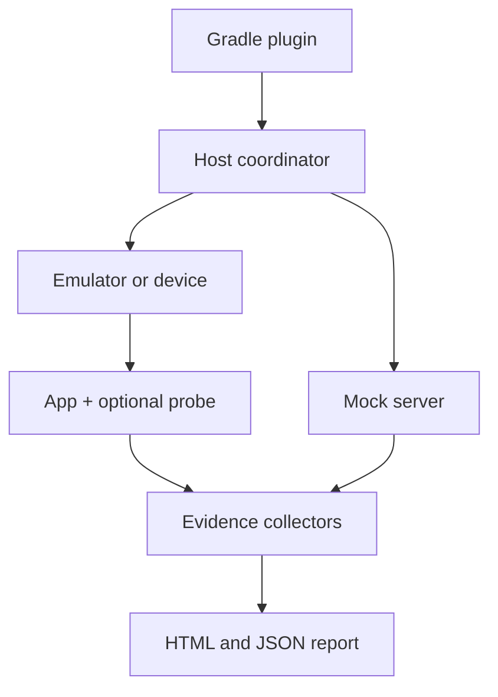

# DroidProof

**Reproducible, evidence-oriented verification for Android applications.**

DroidProof is a planned open-source Android verification harness that will turn test executions into artifact-bound, human-readable, and machine-readable evidence. It will correlate application identity, device configuration, UI state, screenshots, semantics, logs, and network activity to show how a specific Android build behaved under a defined scenario.

> [!IMPORTANT]
> DroidProof is currently in early development. The JVM evidence core, read-only ADB device capture adapter, and one narrow artifact-bound Android smoke scenario are implemented. These APIs are not yet a stable release.

## Current implementation

The current executable slices provide platform-independent Kotlin/JVM modules:

- `droidproof-model` defines validated identities, portable bundle paths, schema-v2 evidence descriptors, an environment contract, and timeline events.
- `droidproof-evidence` copies evidence through bounded buffers, calculates SHA-256 and byte size while streaming, writes bundles transactionally, and verifies existing bundles with structured issue codes.
- `droidproof-device` collects observed device metadata, a display screenshot, and optional PID-filtered logcat through installed ADB Platform Tools. It depends on the model; the evidence core does not depend on device code.
- `droidproof-host` executes one strict JSON smoke scenario against an explicitly selected test emulator, binds the installed APK bytes before and after observation, launches one activity, polls one accessibility node, and writes a verified schema-v3 bundle.

Schema version 2 binds every copied evidence file to the manifest. Inventory paths are deterministic and lexicographically ordered. Schema version 1 remains readable, but its verification result warns that file integrity is unavailable instead of claiming success for checks that format cannot support. See [ADR 0002](docs/adr/0002-evidence-file-integrity.md) for the compatibility and path-safety policy.

Build and test it with JDK 17:

```bash
./gradlew check
```

### 1. Synthetic bundle generation

Generate the deterministic checkout retry example (no SDK or device required):

```bash
./gradlew :droidproof-evidence:generateSampleEvidence
```

The generated bundle is at `droidproof-evidence/build/droidproof-samples/proof-checkout-offline-retry/`. It is build output and is not committed.

Verify a bundle programmatically:

```kotlin
val result = EvidenceBundleVerifier().verify(bundlePath)
if (!result.isValid) {
    result.errors.forEach { issue ->
        println("${issue.code}: ${issue.path ?: "bundle"}: ${issue.message}")
    }
}
```

The sample generation task runs this verifier itself and fails if the generated bundle is invalid.

Hashes verify consistency against the supplied manifest, not authenticity or application correctness. Someone who can change both a file and its manifest can produce another self-consistent bundle. Bundle replacement provides rollback for caught installation failures using backup and rename; it is not a crash-atomic transaction.

### 2. Real device capture

Use an already-authorized test device or emulator and installed Android SDK Platform Tools. Confirm the serial belongs to the intended test device before collecting its display. Screenshots, device identity, and logs can contain sensitive information; keep captures local and do not upload them as CI artifacts.

```bash
# Replace emulator-5554 with the serial of your authorized test emulator/device.
./gradlew :droidproof-device:captureDeviceEvidence \
  -Pdroidproof.deviceSerial=emulator-5554

# An explicit executable path may contain spaces; quote the whole property argument.
./gradlew :droidproof-device:captureDeviceEvidence \
  '-Pdroidproof.adbPath=/opt/Android SDK/platform-tools/adb' \
  -Pdroidproof.deviceSerial=emulator-5554

# Opt in to a bounded snapshot for a known positive process ID.
./gradlew :droidproof-device:captureDeviceEvidence \
  -Pdroidproof.deviceSerial=emulator-5554 \
  -Pdroidproof.includeLogcat=true -Pdroidproof.pid=12345 \
  -Pdroidproof.commandTimeoutMillis=15000 \
  -Pdroidproof.textLimitBytes=65536 \
  -Pdroidproof.screenshotLimitBytes=33554432 \
  -Pdroidproof.logcatLimitBytes=1048576
```

All project properties are optional except `droidproof.pid` when logcat is enabled; omit PID when logcat is disabled. `deviceSerial` may be omitted only when exactly one device is listed, and it must be authorized and online. With multiple devices, offline and unauthorized entries still count toward ambiguity. The exact supplied serial is required when configured.

ADB is resolved at task execution: `droidproof.adbPath` first (invalid explicit paths fail), then `ANDROID_HOME/platform-tools`, then legacy `ANDROID_SDK_ROOT/platform-tools`, then nonempty `PATH` entries. Windows uses `adb.exe`. DroidProof does not install tools, accept licenses, restart the shared ADB server, or change machine settings. Ordinary ADB clients may start the shared server if it is absent.

The defaults for limits are shown above; timeout is per command, between 1 and 3,600,000 milliseconds, and byte limits are between 1 and 2,147,483,647. Text stdout and stderr are independently bounded; screenshot and logcat limits replace the stdout limit for those operations. PNG validation also caps decoded images at 16,777,216 pixels and 100,000 chunks. The task is explicit, never part of `check` or `test`, never up-to-date or restored from the build cache, and supports the repository's configuration cache. Missing ADB does not affect configuration or offline tests.

Each invocation creates a fresh directory under `droidproof-device/build/droidproof-captures/` containing:

- `capture.json`: collector schema version 1, observed metadata, host collection timestamps, outcomes, issues, relative file descriptors, and limitations;
- `screenshots/display.png`: published only after a successful command and bounded PNG validation;
- `logs/logcat.txt`: published only after an explicitly requested, successful, nonempty PID-filtered snapshot.

Logcat is disabled by default. It uses `logcat -d --pid=<PID> -v threadtime` only after the device's help advertises PID filtering. Unsupported filtering never falls back to device-wide logs. Empty, failed, unsupported, and output-limited snapshots have distinct outcomes; partial logs are not published as complete. A log failure preserves a successful screenshot and makes the result partial. The Gradle task exits unsuccessfully for partial or failed captures and prints the output location. An output-root or `capture.json` write failure can prevent a result document; already published files remain local for inspection.

PID reuse, process restarts, historical log retention, device permissions, and log filtering limit attribution. A snapshot contains only currently retained accessible records; it does not establish complete application history. No logs are cleared, apps started/stopped, or processes discovered. Host start/end timestamps use an injectable host clock and are collection observations, not application event times or a cross-process causal clock. A valid screenshot may show a blank/protected screen or another application. Secure-window restrictions are never bypassed, and no rendering correctness is inferred. Two real captures are not expected to be byte-identical.

`DeviceCollector.capture(CaptureRequest(...))` returns `CaptureResult` with `CollectedFile` values. Each contains a local source `Path`, a validated `BundleRelativePath` destination, media type, and `EvidenceFileRole`. A future coordinator can map these into `EvidenceFileInput`; host absolute source paths are not serialized. The offline integration test exercises this mapping and verifies a schema-v2 bundle using explicitly synthetic manifest values.

### 3. Artifact-bound smoke scenario

The live task requires one local APK, one checked JSON scenario and the exact serial of an already-authorized test emulator. It never runs from `check` or `test`, never starts an emulator, and is never treated as up-to-date or restored from cache. Logcat stays disabled.

Build the standalone sample separately. Android Gradle Plugin 8.8.2 requires Gradle 8.10.2 and JDK 17; the sample compiles against Android API level 35. Generate the disposable development key outside the repository:

```bash
keytool -genkeypair -keystore /tmp/droidproof-smoke-keystore.jks \
  -storepass droidproof -keypass droidproof -alias droidproof-smoke \
  -keyalg RSA -keysize 2048 -validity 3650 \
  -dname 'CN=DroidProof Local Sample'

DROIDPROOF_SAMPLE_STORE_PASSWORD=droidproof \
DROIDPROOF_SAMPLE_KEY_PASSWORD=droidproof \
./gradlew -p samples/smoke-app assembleRelease \
  -Pdroidproof.sample.keystore=/tmp/droidproof-smoke-keystore.jks \
  -Pdroidproof.sample.keyAlias=droidproof-smoke
```

Run the passing scenario after confirming the serial belongs to the intended test emulator:

```bash
./gradlew :droidproof-host:runSmokeScenario \
  -Pdroidproof.apkPath=samples/smoke-app/build/outputs/apk/release/smoke-app-release.apk \
  -Pdroidproof.scenarioPath=samples/smoke-app/scenarios/passing.json \
  -Pdroidproof.deviceSerial=emulator-5554
```

Run the intentionally failing scenario by changing the scenario path to `samples/smoke-app/scenarios/failing.json`. That task is expected to exit unsuccessfully while preserving an integrity-valid failed-scenario bundle. Add `-Pdroidproof.replaceExisting=true` only when intentionally replacing different bytes already installed for the target package. Set `-Pdroidproof.adbPath=/absolute/path/to/adb` when discovery is unsuitable.

Each invocation uses a fresh location below `droidproof-host/build/droidproof-runs/`. A published bundle contains `manifest.json`, `timeline.json`, the exact accepted `scenario/scenario.json`, execution and artifact-binding documents, the retained UI hierarchy, collector metadata and screenshot when available. The task succeeds only when execution completed, the assertion passed, required evidence is complete and bundle verification succeeded.

Schema version 3 records requested configuration separately from observed environment values. Unknown locale, orientation, animation scales, random seed and application clock remain unavailable with reasons; no placeholder values are invented. `ScenarioIdentity.dataSha256` is the hash of the exact bytes stored at `scenario/scenario.json`. Schema v1/v2 reading and the schema-v2 synthetic writer remain supported. See [ADR 0004](docs/adr/0004-artifact-bound-android-smoke-execution.md).

The verdict proves only that one package/resource-ID/exact-text node was exposed by the accessibility hierarchy for the identified APK at the recorded observation points. Screenshot and hierarchy are sequential observations. APK hash equality is not continuous attestation, hashes do not authenticate the producer, and no certificate fingerprint is claimed.

## Motivation

A conventional test result usually says that a test passed or failed. It often does not preserve enough context to answer:

- Which APK or App Bundle was tested?
- Which device, API level, locale, scenario data, and environment were used?
- What happened across the UI, application, network, and system layers?
- Which evidence supports each behavioral assertion?
- Can the same execution be reproduced later?
- Can a CI pipeline or coding agent interpret the result without parsing raw logs?

DroidProof aims to provide that missing evidence and reproducibility layer. It is not intended to replace JUnit, Compose Test, Espresso, UI Automator, device farms, or performance tools. It will coordinate and enrich them.

## Planned architecture



### Components

- **Gradle plugin:** discovers scenarios, resolves build variants, and exposes DroidProof tasks.
- **Host coordinator:** currently controls the narrow smoke execution lifecycle and correlates its host observations.
- **Device adapter:** installs artifacts and controls emulators or physical devices.
- **Mock server:** provides deterministic backend responses and controlled failure conditions.
- **Optional application probe:** exposes selected test hooks in non-production builds.
- **Evidence collectors:** capture screenshots, semantics, logcat, network exchanges, and environment metadata.
- **Report generator:** produces evidence for developers, CI systems, and automated agents.

## Core model

DroidProof will treat verification as three versioned inputs and one structured output:

```text
Android artifact + scenario + environment contract -> evidence bundle
```

The generated checkout retry bundle contains:

```text
proof-checkout-offline-retry/
├── manifest.json
├── timeline.json
└── network/
    └── orders-attempt-2.json
```

The schema-v2 manifest binds the result to information such as:

- APK or App Bundle hash;
- signing-certificate fingerprint;
- Git commit;
- scenario and scenario-data hashes;
- device fingerprint and API level;
- locale, orientation, and animation configuration;
- random seed and controlled clock, when available;
- DroidProof version.
- copied evidence paths, media types, byte sizes, and SHA-256 digests.

The repository can also execute the single native smoke scenario described above. It does not support general scenario actions, Compose semantics or intercepted network traffic. The sample's network document remains synthetic scenario evidence used to exercise the JVM bundle API. Emulator lifecycle control, a mock server, HTML reporting, and a CLI remain unimplemented.

## Key differentiators

### Artifact-bound verification

Every execution will identify the exact application artifact and environment that produced the result.

### Evidence graph

Assertions will be connected to their supporting evidence instead of being presented only as pass/fail values or unrelated attachments.

For example, the claim `order-created-once` may be supported by one HTTP request, one accepted response, a corresponding semantic UI state, and the absence of a duplicate retry.

### Cross-layer timeline

DroidProof will correlate events from the host, Android system, application process, test process, and mock server into a causal execution timeline.

### Deterministic fault injection

Later releases are expected to support repeatable failures positioned around meaningful events, such as terminating a connection after the server commits a request but before the client receives the response.

### Machine-readable results

The JSON evidence format will allow CI pipelines and coding agents to identify the first behavioral divergence without interpreting screenshots or unstructured logs.

## Planned execution modes

| Mode | Artifact | Intended visibility |
| --- | --- | --- |
| Black box | Exact signed release APK | Externally observable behavior |
| Proof release | Minified, non-debuggable release-like build with selected hooks | UI, network, and controlled internal evidence |
| Instrumented | Debug/test build with the optional probe | Maximum development diagnostics |

Black-box execution will use out-of-process Android testing capabilities so that release builds can be exercised without modifying or weakening the APK.

## Proposed scenario API

The initial API will integrate with Kotlin and JUnit rather than introduce a separate scenario language.

```kotlin
@get:Rule
val proof = DroidProofRule(
    scenarioId = "checkout-offline-retry"
)

@Test
fun submitAfterConnectivityReturns() = proof.run {
    environment {
        locale("en-US")
        orientation(Orientation.PORTRAIT)

        backend {
            get("/checkout/config")
                .respond(scenarioData("checkout.json"))

            post("/orders")
                .respondSequence(
                    httpError(503),
                    json("order-created.json")
                )
        }
    }

    execute {
        launchDeepLink("sample://checkout/cart-42")
        onElement("customer-name").typeText("Alex")
        onElement("submit").click()
        process.kill()
        process.relaunch()
    }

    verify {
        screen("order-created")
        request("/orders").wasSentExactlyOnce()
        noUnhandledExceptions()
    }
}
```

This API is illustrative and will evolve through executable prototypes and user feedback.

## Proposed modules

```text
droidproof/
├── droidproof-model/             # Scenario and evidence models
├── droidproof-gradle-plugin/     # Gradle tasks and variant integration
├── droidproof-host/              # Host-side coordinator
├── droidproof-device/            # Device and emulator control
├── droidproof-runner/            # Instrumentation integration
├── droidproof-ui-automator/      # Black-box interactions
├── droidproof-compose/           # Compose semantic evidence
├── droidproof-probe/             # Optional build-time application bridge
├── droidproof-network/           # Recording and fault injection
├── droidproof-mock-server/       # Deterministic backend simulation
├── droidproof-evidence/          # Evidence collection and correlation
├── droidproof-report/            # HTML and JSON reports
└── samples/                       # Demonstration Android applications
```

## Technology direction

The first implementation is expected to use:

- Kotlin;
- Gradle Plugin API;
- JUnit;
- AndroidX Test and UI Automator;
- Compose testing and semantics APIs;
- Kotlin coroutines;
- Kotlin serialization;
- a local JVM mock server;
- static HTML and JSON report generation.

## Contributing

DroidProof is currently being shaped through architecture experiments. Design discussions, use cases, failure scenarios, and feedback about Android verification workflows will be welcome once the initial repository structure is available.
