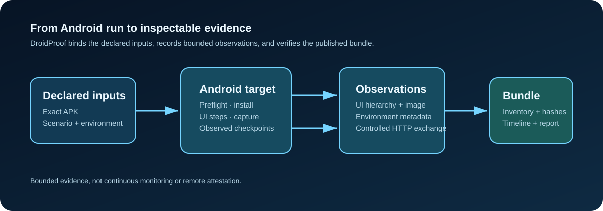
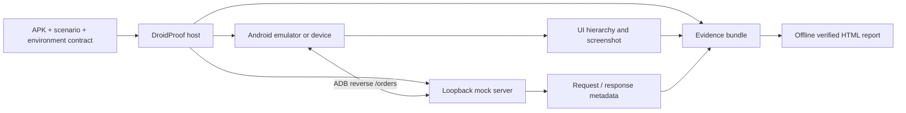
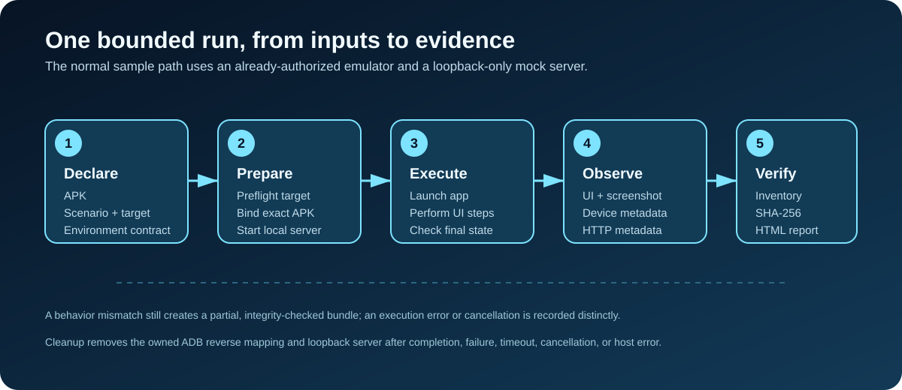
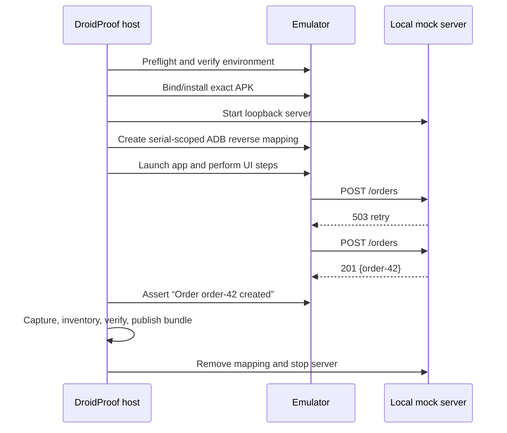
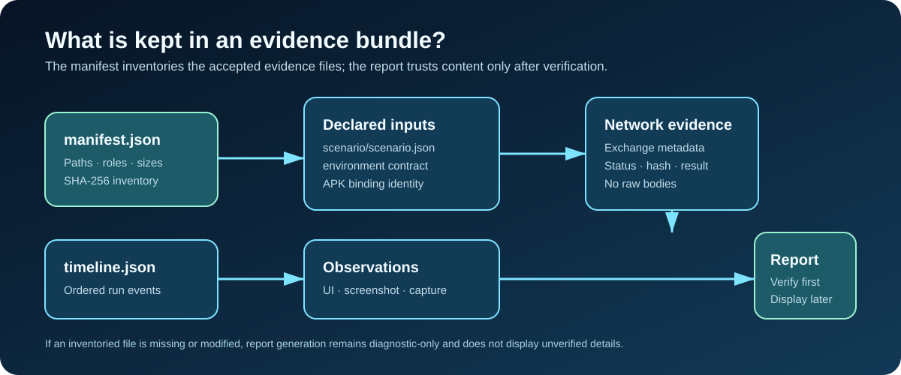
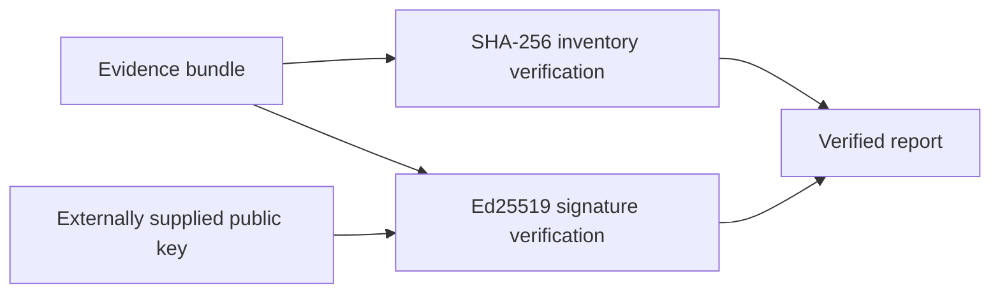

# DroidProof

> Artifact-bound, evidence-oriented verification for Android applications.



DroidProof runs a small, controlled Android scenario and produces an evidence bundle that can be checked later. Rather than simply reporting that a test passed, it records the APK that ran, the scenario, selected emulator observations, UI captures, network observations, and an integrity inventory.

It is an early Kotlin/JVM prototype. Its APIs and schemas are not yet stable.

## Read this guide in the order you need

If you are new to DroidProof, do not start with emulator provisioning or signing. Take the smallest path first:

1. Run `./gradlew check` to verify the project without Android.
2. Generate the synthetic sample to see a real evidence bundle without a device.
3. Follow [Run the sample scenario](#run-the-sample-scenario) when an authorized emulator is ready.
4. Use [Read a bundle](#read-a-bundle) to turn any saved bundle into an offline report.

The remaining sections describe target lifecycle, authentication, and recovery for more specialized use cases.

### Three terms to know

| Term | Plain-language meaning |
| --- | --- |
| **Scenario** | The small, versioned JSON declaration of what DroidProof should do and check. |
| **Evidence bundle** | The output folder: declared inputs, observations, timeline, and an integrity inventory. |
| **Report** | A disposable, offline HTML view generated from a bundle after it has been verified. |

## What problem does it solve?

An ordinary UI test answers: **did this test pass right now?** DroidProof is aimed at a narrower, auditable question:

> Did this exact APK complete this declared scenario on this observed Android target, and does the saved evidence still match what was published?

The answer is deliberately bounded. DroidProof does not provide remote attestation, continuous monitoring, exclusive emulator ownership, traffic interception, or proof that no one changed the device between observations.



## Start here

Pick the smallest path that answers your need.

| I want to… | Command | Requires Android? |
| --- | --- | --- |
| Check the project itself | `./gradlew check` | No |
| Inspect a sample evidence bundle | `./gradlew :droidproof-evidence:generateSampleEvidence` | No |
| Capture an already-authorized device/emulator | `./gradlew :droidproof-device:captureDeviceEvidence -Pdroidproof.deviceSerial=emulator-5554` | Yes |
| Run the full sample order scenario | Follow [Run the sample scenario](#run-the-sample-scenario) | Yes |
| Use DroidProof outside this checkout | Use the [CLI or Gradle plugin](#use-droidproof-in-another-project) | For scenario runs |
| Turn a saved bundle into a report | Follow [Read a bundle](#read-a-bundle) | No |

### 1. Verify the project

Install JDK 17, then run:

```bash
./gradlew check
```

This checks all JVM modules without an Android SDK, ADB, emulator, device, network service, or external server. It also runs an offline external-consumer verification that publishes to a fresh temporary Maven repository, exercises the installed CLI from a separate directory, and applies the plugin in a separate Gradle build.

### 2. Create evidence without Android

```bash
./gradlew :droidproof-evidence:generateSampleEvidence
```

The verified, synthetic sample is written to:

```text
droidproof-evidence/build/droidproof-samples/proof-checkout-offline-retry/
```

It is useful for exploring the bundle and report format. It is not evidence from a real Android run.

### 3. Capture an existing Android target

For a bounded capture of an already-authorized device or emulator, provide its serial:

```bash
./gradlew :droidproof-device:captureDeviceEvidence \
  -Pdroidproof.deviceSerial=emulator-5554
```

PID-filtered logcat is deliberately opt-in:

```bash
./gradlew :droidproof-device:captureDeviceEvidence \
  -Pdroidproof.deviceSerial=emulator-5554 \
  -Pdroidproof.includeLogcat=true \
  -Pdroidproof.pid=12345
```

## Run the sample scenario



The checked-in smoke app makes a real, controlled HTTPS `POST /orders` request. The host starts a loopback-only TLS server, maps the emulator’s stable port to it with ADB reverse, and checks the two expected requests: first a `503` retry response, then a `201` success response. The app finishes with `Order order-42 created`.

### What you will do

1. Build the demonstration APK with a local disposable signing key.
2. Run the declared scenario against an already-authorized emulator.
3. Find the new bundle below `droidproof-host/build/droidproof-runs/`.
4. Generate and inspect an offline HTML report from that bundle.

### Prerequisites

- JDK 17
- Android SDK with compile SDK 35 and Platform Tools
- One already-authorized emulator in Android primary user 0
- The exact `adb` path and emulator serial
- `keytool` (included with a JDK) to sign the local sample APK

The default environment mode is `VERIFY_ONLY`: DroidProof checks the requested locale, locked orientation, and animation scales but does not change them.

### Build the sample APK

From the repository root, create a disposable signing key outside the repository and build the release APK:

```bash
keytool -genkeypair -keystore /tmp/droidproof-smoke-keystore.jks \
  -storepass droidproof -keypass droidproof -alias droidproof-smoke \
  -keyalg RSA -keysize 2048 -validity 3650 \
  -dname 'CN=DroidProof Local Sample'

DROIDPROOF_SAMPLE_STORE_PASSWORD=droidproof \
DROIDPROOF_SAMPLE_KEY_PASSWORD=droidproof \
ANDROID_HOME=/absolute/path/to/Android/Sdk \
./gradlew -p samples/smoke-app assembleRelease \
  -Pdroidproof.sample.keystore=/tmp/droidproof-smoke-keystore.jks \
  -Pdroidproof.sample.keyAlias=droidproof-smoke
```

The output APK is `samples/smoke-app/build/outputs/apk/release/DroidProofSmokeApp-release.apk`.

### Run it against an existing emulator

Set the exact serial you confirmed with `adb devices`, then run the scenario. All input paths must be absolute; `$PWD` makes the repository paths absolute.

```bash
export DROIDPROOF_EMULATOR_SERIAL='emulator-5554'

./gradlew :droidproof-host:runSmokeScenario \
  -Pdroidproof.apkPath="$PWD/samples/smoke-app/build/outputs/apk/release/DroidProofSmokeApp-release.apk" \
  -Pdroidproof.scenarioPath="$PWD/samples/smoke-app/scenarios/network-request-passing.json" \
  -Pdroidproof.environmentPath="$PWD/samples/smoke-app/environments/verify-only-en-us-portrait.json" \
  -Pdroidproof.deviceSerial="$DROIDPROOF_EMULATOR_SERIAL" \
  -Pdroidproof.adbPath=/absolute/path/to/Android/Sdk/platform-tools/adb \
  -Pdroidproof.replaceExisting=true
```

`replaceExisting=true` is only needed when you intentionally want to replace different installed bytes for the sample package.

### What happens during the run?



The host writes a fresh run directory below `droidproof-host/build/droidproof-runs/` and prints its location. If mock-server setup fails, DroidProof does not fall back to LAN or uncontrolled networking. Owned mappings and the server are cleaned up after success, assertion failure, timeout, cancellation, or host failure.

`network-fault-passing.json` is the schema-v5 retry example: its first planned exchange deliberately closes the loopback connection, and its second returns the successful order response. V5 also supports a declared response delay of up to five seconds. These faults apply only to this controlled endpoint.

### See a deliberate failure

Use `network-request-failing.json` in place of the passing scenario:

```bash
./gradlew :droidproof-host:runSmokeScenario \
  -Pdroidproof.apkPath="$PWD/samples/smoke-app/build/outputs/apk/release/DroidProofSmokeApp-release.apk" \
  -Pdroidproof.scenarioPath="$PWD/samples/smoke-app/scenarios/network-request-failing.json" \
  -Pdroidproof.environmentPath="$PWD/samples/smoke-app/environments/verify-only-en-us-portrait.json" \
  -Pdroidproof.deviceSerial="$DROIDPROOF_EMULATOR_SERIAL" \
  -Pdroidproof.adbPath=/absolute/path/to/Android/Sdk/platform-tools/adb
```

The app still succeeds, but the scenario expects the wrong request body. The bundle records request mismatches, the scenario verdict is `FAILED`, and Gradle exits nonzero.

## Choose the Android target

| Target mode | When to use it | Key properties | Ownership behavior |
| --- | --- | --- | --- |
| Existing device/emulator | You already started and authorized it | `deviceSerial` | Never started or stopped by DroidProof |
| Existing AVD | DroidProof should start one known AVD | `avdName`, `emulatorPort` | Stops only the process it started |
| Provisioned AVD | You need a clean, isolated AVD from installed SDK components | `provisioningPath`, SDK tool paths, state root | Creates, wipes, verifies, stops, and removes only its marked state |

`deviceSerial`, `avdName`, and provisioning are mutually exclusive.

### Start an existing AVD

Omit `deviceSerial`, name the AVD exactly, and specify a port:

```bash
./gradlew :droidproof-host:runSmokeScenario \
  -Pdroidproof.apkPath="$PWD/samples/smoke-app/build/outputs/apk/release/DroidProofSmokeApp-release.apk" \
  -Pdroidproof.scenarioPath="$PWD/samples/smoke-app/scenarios/network-request-passing.json" \
  -Pdroidproof.avdName='Existing_API_35' \
  -Pdroidproof.emulatorPort=5556 \
  -Pdroidproof.adbPath=/absolute/path/to/Android/Sdk/platform-tools/adb \
  -Pdroidproof.replaceExisting=true
```

### Provision a clean owned AVD

Provisioning uses the legacy `avdmanager` and standalone `emulator` tools because they are the only currently demonstrated deterministic backend. DroidProof verifies installed metadata; it never downloads packages, accepts licenses, or touches Android Studio’s normal AVD directory.

Create a strict UTF-8 JSON contract, for example `provisioning.json`:

```json
{
  "schemaVersion": 1,
  "systemImagePackage": "system-images;android-35;google_apis;x86_64",
  "systemImageRevision": "1",
  "apiLevel": 35,
  "abi": "x86_64",
  "emulatorRevision": "35.1.4",
  "platformToolsRevision": "35.0.2",
  "commandLineToolsRevision": "12.0",
  "deviceProfile": "pixel_5",
  "buildFingerprint": "optional/exact/fingerprint"
}
```

Then run:

```bash
./gradlew :droidproof-host:runSmokeScenario \
  -Pdroidproof.apkPath="$PWD/samples/smoke-app/build/outputs/apk/release/DroidProofSmokeApp-release.apk" \
  -Pdroidproof.scenarioPath="$PWD/samples/smoke-app/scenarios/network-request-passing.json" \
  -Pdroidproof.provisioningPath=/absolute/path/to/provisioning.json \
  -Pdroidproof.sdkRoot=/absolute/path/to/Android/Sdk \
  -Pdroidproof.avdManagerPath=/absolute/path/to/Android/Sdk/cmdline-tools/12.0/bin/avdmanager \
  -Pdroidproof.emulatorPath=/absolute/path/to/Android/Sdk/emulator/emulator \
  -Pdroidproof.adbPath=/absolute/path/to/Android/Sdk/platform-tools/adb \
  -Pdroidproof.provisioningStateRoot=/absolute/path/to/droidproof-owned-avds
```

The AVD is started with `-wipe-data` and `-no-snapshot`, checked for the contract’s API/ABI and optional fingerprint, then stopped and removed. This is controlled baseline selection—not remote attestation or universal emulator determinism.

Android CLI can be inspected but is intentionally fail-closed for provisioning:

```bash
./gradlew :droidproof-host:probeAndroidCliCompatibility \
  -Pdroidproof.androidCliPath=/absolute/path/to/android \
  -Pdroidproof.sdkRoot=/absolute/path/to/Android/Sdk \
  -Pdroidproof.androidCliProbeTimeoutMillis=15000
```

The read-only report is written to `droidproof-host/build/reports/android-cli-compatibility.json`. It does not prove that Android CLI can safely provision a DroidProof target.

## Read a bundle



A successful network run contains evidence similar to this:

```text
bundle/
├── manifest.json                 # inventory: names, roles, byte sizes, SHA-256
├── timeline.json                 # canonical ordered events
├── scenario/scenario.json        # exact scenario bytes
├── execution/                    # APK binding and result
├── environment/                  # contract, evaluation, continuity observations
├── ui/steps/                     # UI hierarchies captured during steps
├── screenshots/display.png
├── capture/capture.json
└── network/exchanges/            # request / response metadata, not raw bodies
```

`authenticity.json` appears only for an optionally signed bundle. Network exchanges contain bounded request/response metadata, size, SHA-256, status, and match outcome; raw request and response bodies are not copied into those exchange files.

### Generate the offline HTML report

Use a path outside the bundle for the output:

```bash
./gradlew :droidproof-report:generateEvidenceReport \
  -Pdroidproof.bundlePath=/absolute/path/to/bundle \
  -Pdroidproof.reportPath=/absolute/path/to/report.html
```

Without `reportPath`, the default is `droidproof-report/build/reports/droidproof/evidence-report.html`.

The static report has inline CSS, no JavaScript, and no external resources. It verifies the bundle before displaying it. A missing or tampered inventoried file produces a limited diagnostic report and omits unverified execution, environment, network, and preview data.

## Use DroidProof in another project

### Command-line interface

Build an installable distribution, then invoke its `droidproof` launcher from any directory. The checked-in consumer verification covers `--help`, `--version`, valid and invalid scenario validation, verified reporting of synthetic evidence, exit statuses, and paths with spaces:

```bash
./gradlew :droidproof-cli:installDist

droidproof-cli/build/install/droidproof/bin/droidproof validate-scenario \
  --scenario /absolute/path/to/scenario.json

droidproof-cli/build/install/droidproof/bin/droidproof run \
  --apk /absolute/path/to/app.apk \
  --scenario /absolute/path/to/scenario.json \
  --device-serial emulator-5554 \
  --adb /absolute/path/to/adb \
  --output /absolute/path/to/evidence
```

The CLI also provides `report`, `recover`, and `probe-android-cli`; use `droidproof COMMAND --help` for each command's arguments. Invalid usage exits with status 2, while an unsuccessful operation exits with status 1. `probe-android-cli` writes a read-only compatibility report; Android CLI provisioning remains explicitly refused.

### Published Gradle plugin

The plugin ID is `io.github.fredleonam.droidproof`. For an isolated local consumer check, use the built-in verifier:

```bash
./gradlew verifyExternalConsumer
```

It publishes the plugin marker, DroidProof modules, and resolved runtime closure to a fresh temporary Maven repository, then runs a separate consumer build with `--offline`. It does not publish to Maven Local or prove availability from a public Maven repository.

The tested external consumer uses this repository configuration and applies the typed extension:

```groovy
// settings.gradle, where droidProofRepository is the isolated repository path
def droidProofRepository = file('/absolute/path/to/droidproof-repository')

pluginManagement {
    repositories {
        maven {
            url = uri(droidProofRepository)
            metadataSources { mavenPom(); artifact() }
        }
    }
}

dependencyResolutionManagement {
    repositories {
        maven {
            url = uri(droidProofRepository)
            metadataSources { mavenPom(); artifact() }
        }
    }
}

rootProject.name = 'droidproof-external-consumer'
```

```groovy
// build.gradle
plugins {
    id 'io.github.fredleonam.droidproof' version '0.1.0-SNAPSHOT'
}

droidProof {
    scenario.set(layout.projectDirectory.file('scenarios/release-proof.json'))
    bundle.set(layout.projectDirectory.dir('sample evidence'))
    report.set(layout.buildDirectory.file('reports/droidproof/evidence-report.html'))
}
```

`droidProofRun` executes the configured scenario, `droidProofValidateScenario` validates it without Android, and `droidProofReport` verifies `bundle` and writes `report`. The external verification generates a schema-v6 scenario with the DSL, validates it through the plugin, and creates a report from synthetic evidence. The plugin artifact is `io.github.fredleonam.droidproof:droidproof-gradle-plugin`.

### Kotlin scenario DSL

The `droidproof-scenario-dsl` artifact creates validated schema-v6 JSON and supports all current UI, Compose, loopback transport, response, and bounded-fault declarations:

```kotlin
import io.github.fredleonam.droidproof.scenario.Transport
import io.github.fredleonam.droidproof.scenario.scenario
import java.nio.file.Path

scenario {
    id = "release-order"
    packageName = "com.example.app"
    launchActivity = ".MainActivity"
    backend {
        transport = Transport.HTTPS
        expectJson("""{"customer":"Proof42"}""")
        respond(503, """{"error":"retry"}""", delayMillis = 250)
        respond(201, """{"orderId":"42"}""")
    }
    typeText("customer", "Proof42")
    tap("submit")
    assertText("status", "Order 42 created")
}.writeTo(Path.of("scenarios/release-proof.json"))
```

Resource names are expanded to `<packageName>:id/<name>`; fully qualified resource IDs are also accepted. Focused tests cover deterministic output, JSON round trips through the strict `SmokeScenarioLoader`, Compose assertions, backend responses and bounded faults, and representative invalid declarations. The external plugin consumer also validates a DSL-generated schema-v6 file.

## Optional: sign and authenticate a bundle

Integrity answers “does this bundle still match its manifest?” Authentication separately answers “does this manifest/timeline core verify with an externally trusted key?”



Generate disposable Ed25519 keys outside the repository:

```bash
DROIDPROOF_KEY_DIR="$(mktemp -d /tmp/droidproof-ed25519.XXXXXX)"
chmod 700 "$DROIDPROOF_KEY_DIR"
openssl genpkey -algorithm ED25519 -out "$DROIDPROOF_KEY_DIR/private-key.pem"
chmod 600 "$DROIDPROOF_KEY_DIR/private-key.pem"
openssl pkey -in "$DROIDPROOF_KEY_DIR/private-key.pem" -pubout \
  -out "$DROIDPROOF_KEY_DIR/public-key.pem"
```

Add both properties to `runSmokeScenario`:

```text
-Pdroidproof.signingPrivateKeyPath="$DROIDPROOF_KEY_DIR/private-key.pem"
-Pdroidproof.signingPublicKeyPath="$DROIDPROOF_KEY_DIR/public-key.pem"
```

Then authenticate while producing the report:

```bash
./gradlew :droidproof-report:generateEvidenceReport \
  -Pdroidproof.bundlePath=/absolute/path/to/bundle \
  -Pdroidproof.reportPath=/absolute/path/to/report.html \
  -Pdroidproof.trustedPublicKeyPath="$DROIDPROOF_KEY_DIR/public-key.pem"
```

Never commit the private key. The bundle does not include a public key, so trust must come from outside the bundle. Signing is limited producer provenance; it is not a certificate system, timestamping, revocation, remote attestation, or proof that observations are true.

## Environment modes and recovery

`VERIFY_ONLY` is the default: it only checks the requested locale, locked user-0 orientation, and three animation scales.

`APPLY_AND_RESTORE` is opt-in. It snapshots those narrow fields, writes an external recovery journal before changing anything, applies the contract, runs the scenario, restores the snapshot, and verifies restoration. If an interrupted run leaves a journal, recover explicitly with the same authorized serial:

```bash
./gradlew :droidproof-host:recoverEmulatorEnvironment \
  -Pdroidproof.deviceSerial="$DROIDPROOF_EMULATOR_SERIAL" \
  -Pdroidproof.adbPath=/absolute/path/to/Android/Sdk/platform-tools/adb \
  -Pdroidproof.recoveryStateRoot=/absolute/state/root
```

Recovery only writes when a fresh API level, build fingerprint, and boot identifier match the saved journal. It retains the journal and prints safe manual restoration values if identity has drifted or is unavailable.

## What is implemented?

| Area | Current scope |
| --- | --- |
| Evidence | Schema v1/v2/v3 reader and verifier; v3 execution bundles; SHA-256 inventory |
| Android capture | Bounded screenshots, allowlisted metadata, optional PID-filtered logcat |
| UI execution | Narrow View resource-ID input/tap/assertion and bounded Compose accessibility-semantics assertions |
| Network | One controlled loopback `POST /orders` endpoint with ordered response, request-contract, and bounded v5 delay/connection-close faults |
| Target lifecycle | External device, existing AVD, or narrowly owned legacy-SDK provisioned AVD |
| Reports | Deterministic, offline static HTML generated only from verified evidence |
| Authentication | Optional JDK 17 Ed25519 signature with caller-supplied external public key |
| Distribution | Installable CLI, publishable Gradle plugin, and Kotlin scenario-authoring DSL |

Not implemented: arbitrary endpoint scripting, TLS MITM or general traffic interception, Espresso probes, PKI/revocation/timestamping, KMS/HSM integration, and remote attestation. The sample supports only explicit loopback TLS termination; it does not install a CA or redirect traffic.

### Compose semantics assertions

Schema v6 supports a final `assertComposeSemantics` step. DroidProof reads the Compose accessibility node through `uiautomator dump` and requires one node to match the app package, a Compose test tag, exact text, and exact content description. Configure the Compose semantics owner with `testTagsAsResourceId = true`, then declare the bare test tag (the package is matched separately):

```json
{"type":"assertComposeSemantics","resourceId":"order_status","text":"Order created","contentDescription":"Order submission succeeded","deadlineMillis":1000,"pollIntervalMillis":100}
```

This is an accessibility-semantics observation. It does not execute Espresso assertions or inspect Compose's in-process semantics tree.

## Contracts and safety boundaries

- Scenario schemas v1–v5 remain readable. V4 adds strict matching for the single controlled JSON request; V5 adds bounded delay and connection-close faults for that same endpoint; V6 adds Compose accessibility-semantics assertions and permits scenarios without a backend plan.
- Environment contracts, environment evaluations, capability observations, continuity observations, transaction-mutation observations, evidence, and authentication each have separate versioned schemas.
- A matching environment or checkpoint is a sequential point observation. It does not prove stability between checks, actor identity, exclusive ownership, or the absence of unrelated changes.
- The mock server proves only what it observed on its controlled endpoint. It does not prove that no other network traffic occurred.
- Screenshots, UI XML, scenario values, logcat, and network metadata may include sensitive test data. Keep bundles local or access-controlled.
- ADB is resolved from an explicit `droidproof.adbPath`, then `ANDROID_HOME/platform-tools`, legacy `ANDROID_SDK_ROOT/platform-tools`, then `PATH`. DroidProof does not install SDK tools, accept licenses, authorize devices, or restart the shared ADB server.

## Project map

```text
droidproof-model       Shared validated contracts and canonical timeline
droidproof-evidence    Bundle writer, verifier, inventory, signing
droidproof-device      Narrow ADB capture
droidproof-mock-server Deterministic loopback HTTP server
droidproof-host        Preflight, lifecycle, scenario execution, publication
droidproof-report      Verified static HTML report
droidproof-scenario-dsl Typed Kotlin scenario authoring and JSON output
droidproof-cli         Installable command-line interface
droidproof-gradle-plugin Published plugin tasks and typed configuration
samples/smoke-app      Demonstration Android app and scenarios
docs/adr               Architecture decision records and detailed limits
```

## Architecture decisions

The detailed design decisions are in [`docs/adr`](docs/adr), including the [evidence core](docs/adr/0001-evidence-core.md), [Android capture](docs/adr/0003-android-device-capture.md), [artifact-bound execution](docs/adr/0004-artifact-bound-android-smoke-execution.md), [network evidence](docs/adr/0008-deterministic-network-evidence.md), [request contracts](docs/adr/0009-request-contract-verification.md), [authentication](docs/adr/0010-authenticated-evidence-bundles.md), [environment recovery](docs/adr/0015-crash-resilient-environment-recovery-journal.md), and [owned provisioning](docs/adr/0018-deterministic-owned-emulator-provisioning.md).
