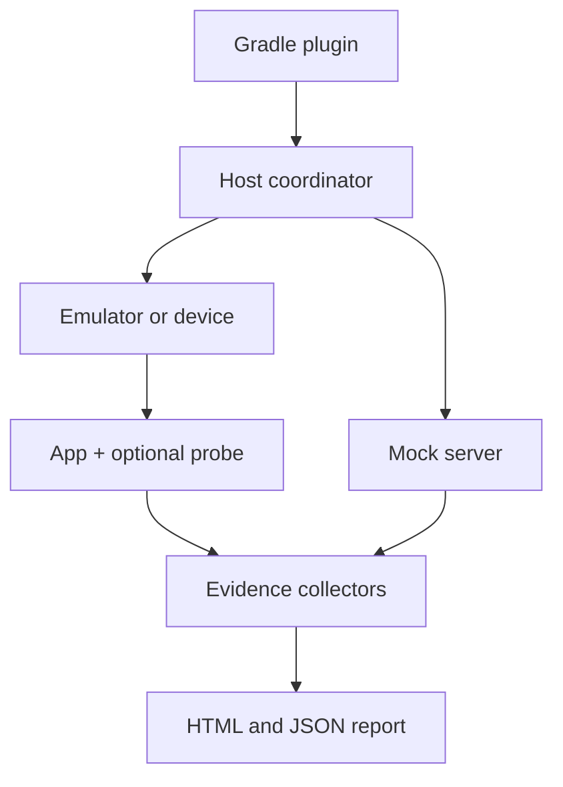

# DroidProof

**Reproducible, evidence-oriented verification for Android applications.**

DroidProof is a planned open-source Android verification harness that will turn test executions into artifact-bound, human-readable, and machine-readable evidence. It will correlate application identity, device configuration, UI state, screenshots, semantics, logs, and network activity to show how a specific Android build behaved under a defined scenario.

> [!IMPORTANT]
> DroidProof is currently in early development. The JVM-only evidence model, bundle writer, and integrity verifier are implemented; Android-facing APIs remain planned and are not yet available as a stable release.

## Current implementation

The current executable slices provide platform-independent Kotlin/JVM modules:

- `droidproof-model` defines validated identities, portable bundle paths, schema-v2 evidence descriptors, an environment contract, and timeline events.
- `droidproof-evidence` copies evidence through bounded buffers, calculates SHA-256 and byte size while streaming, writes bundles transactionally, and verifies existing bundles with structured issue codes.

Schema version 2 binds every copied evidence file to the manifest. Inventory paths are deterministic and lexicographically ordered. Schema version 1 remains readable, but its verification result warns that file integrity is unavailable instead of claiming success for checks that format cannot support. See [ADR 0002](docs/adr/0002-evidence-file-integrity.md) for the compatibility and path-safety policy.

Build and test it with JDK 17:

```bash
./gradlew check
```

Generate the deterministic checkout retry example:

```bash
./gradlew :droidproof-evidence:generateSampleEvidence
```

The generated bundle is at `droidproof-evidence/build/droidproof-samples/proof-checkout-offline-retry/`. It is build output and is not committed.

Verify a bundle programmatically:

```kotlin
val result = EvidenceBundleVerifier().verify(bundlePath)
if (!result.isValid) {
    result.errors.forEach { issue ->
        println("${issue.code}: ${issue.path ?: "bundle"}: ${issue.message}")
    }
}
```

The sample generation task runs this verifier itself and fails if the generated bundle is invalid.

## Motivation

A conventional test result usually says that a test passed or failed. It often does not preserve enough context to answer:

- Which APK or App Bundle was tested?
- Which device, API level, locale, scenario data, and environment were used?
- What happened across the UI, application, network, and system layers?
- Which evidence supports each behavioral assertion?
- Can the same execution be reproduced later?
- Can a CI pipeline or coding agent interpret the result without parsing raw logs?

DroidProof aims to provide that missing evidence and reproducibility layer. It is not intended to replace JUnit, Compose Test, Espresso, UI Automator, device farms, or performance tools. It will coordinate and enrich them.

## Planned architecture



### Components

- **Gradle plugin:** discovers scenarios, resolves build variants, and exposes DroidProof tasks.
- **Host coordinator:** controls the execution lifecycle and correlates events across processes.
- **Device adapter:** installs artifacts and controls emulators or physical devices.
- **Mock server:** provides deterministic backend responses and controlled failure conditions.
- **Optional application probe:** exposes selected test hooks in non-production builds.
- **Evidence collectors:** capture screenshots, semantics, logcat, network exchanges, and environment metadata.
- **Report generator:** produces evidence for developers, CI systems, and automated agents.

## Core model

DroidProof will treat verification as three versioned inputs and one structured output:

```text
Android artifact + scenario + environment contract -> evidence bundle
```

The generated checkout retry bundle contains:

```text
proof-checkout-offline-retry/
├── manifest.json
├── timeline.json
└── network/
    └── orders-attempt-2.json
```

The schema-v2 manifest binds the result to information such as:

- APK or App Bundle hash;
- signing-certificate fingerprint;
- Git commit;
- scenario and scenario-data hashes;
- device fingerprint and API level;
- locale, orientation, and animation configuration;
- random seed and controlled clock, when available;
- DroidProof version.
- copied evidence paths, media types, byte sizes, and SHA-256 digests.

The repository does not yet execute Android applications or collect screenshots, semantics, logcat, or intercepted network traffic. The sample's network document is generated scenario evidence used to exercise the JVM bundle API. ADB, emulator control, a mock server, HTML reporting, and a CLI also remain unimplemented.

## Key differentiators

### Artifact-bound verification

Every execution will identify the exact application artifact and environment that produced the result.

### Evidence graph

Assertions will be connected to their supporting evidence instead of being presented only as pass/fail values or unrelated attachments.

For example, the claim `order-created-once` may be supported by one HTTP request, one accepted response, a corresponding semantic UI state, and the absence of a duplicate retry.

### Cross-layer timeline

DroidProof will correlate events from the host, Android system, application process, test process, and mock server into a causal execution timeline.

### Deterministic fault injection

Later releases are expected to support repeatable failures positioned around meaningful events, such as terminating a connection after the server commits a request but before the client receives the response.

### Machine-readable results

The JSON evidence format will allow CI pipelines and coding agents to identify the first behavioral divergence without interpreting screenshots or unstructured logs.

## Planned execution modes

| Mode | Artifact | Intended visibility |
| --- | --- | --- |
| Black box | Exact signed release APK | Externally observable behavior |
| Proof release | Minified, non-debuggable release-like build with selected hooks | UI, network, and controlled internal evidence |
| Instrumented | Debug/test build with the optional probe | Maximum development diagnostics |

Black-box execution will use out-of-process Android testing capabilities so that release builds can be exercised without modifying or weakening the APK.

## Proposed scenario API

The initial API will integrate with Kotlin and JUnit rather than introduce a separate scenario language.

```kotlin
@get:Rule
val proof = DroidProofRule(
    scenarioId = "checkout-offline-retry"
)

@Test
fun submitAfterConnectivityReturns() = proof.run {
    environment {
        locale("en-US")
        orientation(Orientation.PORTRAIT)

        backend {
            get("/checkout/config")
                .respond(scenarioData("checkout.json"))

            post("/orders")
                .respondSequence(
                    httpError(503),
                    json("order-created.json")
                )
        }
    }

    execute {
        launchDeepLink("sample://checkout/cart-42")
        onElement("customer-name").typeText("Alex")
        onElement("submit").click()
        process.kill()
        process.relaunch()
    }

    verify {
        screen("order-created")
        request("/orders").wasSentExactlyOnce()
        noUnhandledExceptions()
    }
}
```

This API is illustrative and will evolve through executable prototypes and user feedback.

## Proposed modules

```text
droidproof/
├── droidproof-model/             # Scenario and evidence models
├── droidproof-gradle-plugin/     # Gradle tasks and variant integration
├── droidproof-host/              # Host-side coordinator
├── droidproof-device/            # Device and emulator control
├── droidproof-runner/            # Instrumentation integration
├── droidproof-ui-automator/      # Black-box interactions
├── droidproof-compose/           # Compose semantic evidence
├── droidproof-probe/             # Optional build-time application bridge
├── droidproof-network/           # Recording and fault injection
├── droidproof-mock-server/       # Deterministic backend simulation
├── droidproof-evidence/          # Evidence collection and correlation
├── droidproof-report/            # HTML and JSON reports
└── samples/                       # Demonstration Android applications
```

## Technology direction

The first implementation is expected to use:

- Kotlin;
- Gradle Plugin API;
- JUnit;
- AndroidX Test and UI Automator;
- Compose testing and semantics APIs;
- Kotlin coroutines;
- Kotlin serialization;
- a local JVM mock server;
- static HTML and JSON report generation.

## Contributing

DroidProof is currently being shaped through architecture experiments. Design discussions, use cases, failure scenarios, and feedback about Android verification workflows will be welcome once the initial repository structure is available.
